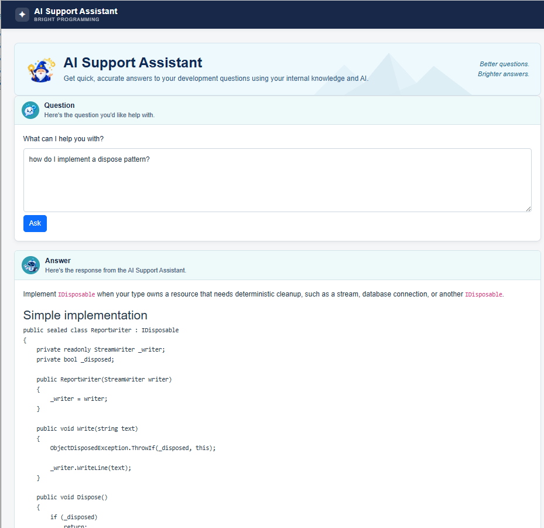

# AI Support Assistant

An AI-powered support assistant for answering development questions using internal knowledge and AI.

The application combines a Blazor web UI, an ASP.NET Core API, project knowledge stored as Markdown, AI-based knowledge matching, and AI answer generation.

## Documentation

### Getting started

- [Getting started](docs/getting-started.md)
- [Configuration](docs/configuration.md)

### Architecture

- [Architecture overview](docs/architecture/overview.md)
- [Application flow](docs/architecture/application-flow.md)
- [Provider model](docs/architecture/provider-model.md)
- [Knowledge architecture](docs/architecture/knowledge-architecture.md)

### Development

- [Development overview](docs/development/overview.md)
- [Project structure](docs/development/project-structure.md)
- [Extending providers](docs/development/extending-providers.md)
- [Testing](docs/development/testing.md)

### Reference

- [API](docs/api.md)
- [Knowledge](docs/knowledge.md)
