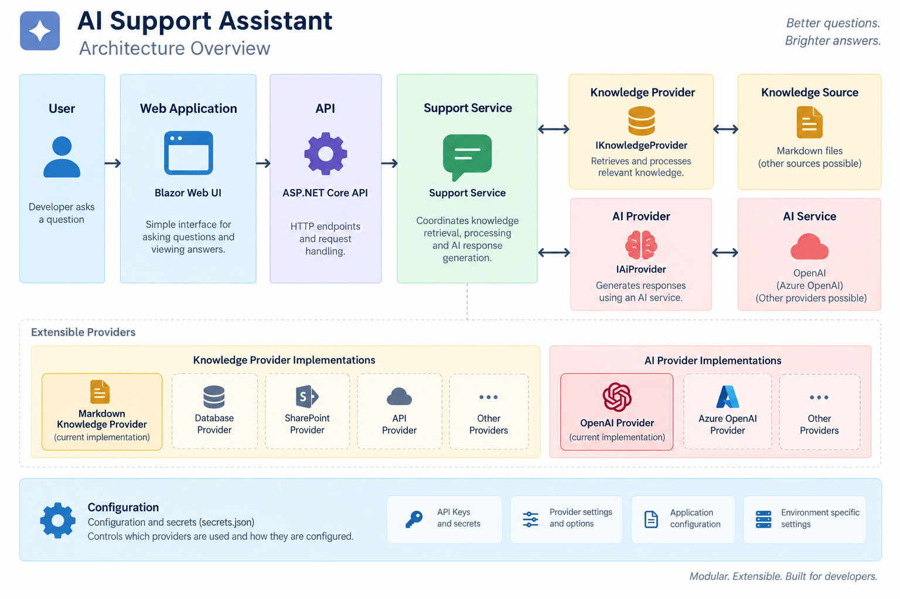

# Architecture

The AI Support Assistant is designed around a small number of clearly separated responsibilities.

The goal is to keep the application simple while allowing the knowledge and AI components to be replaced or extended independently.

## Overview

At a high level, a question follows this path:

**Web UI → API → Support Service → Knowledge Provider → AI Provider → Response**

The main areas of the application are:

- **Web** — Provides the user interface.
- **API** — Provides the HTTP boundary for the application.
- **Support Service** — Coordinates the support request.
- **Knowledge** — Provides access to internal knowledge.
- **AI** — Provides the AI integration.

## Separation of responsibilities

The application separates the responsibilities of the user interface, API, support workflow, knowledge retrieval and AI integration.

This keeps individual components focused and avoids coupling the core support workflow to a particular technology.

For example, the support service does not need to know whether knowledge comes from Markdown files, a database or another system.

## Provider model

The provider model is an important part of the architecture.

The application uses interfaces to define capabilities while allowing different implementations to provide those capabilities.

For example, the knowledge system uses `IKnowledgeProvider`.

The current implementation is `MarkdownKnowledgeProvider`, but the application is not inherently tied to Markdown.

A different implementation could obtain knowledge from a database, SharePoint, an internal API, a document management system or another source.

This means a new knowledge provider can be introduced without changing the core support workflow.

See [Knowledge](knowledge.md) for details of the knowledge provider model and how to implement a custom provider.

## Provider and repository

The current Markdown implementation separates the provider from the repository.

The provider is responsible for providing knowledge to the application, while the repository is responsible for obtaining the underlying Markdown data.

This separation keeps file-system access out of the provider and provides a clear boundary between the application and the storage mechanism.

The same principle can be applied to other knowledge sources.

## AI integration

The AI integration is also isolated from the rest of the application.

The support workflow communicates with an AI abstraction rather than being tightly coupled to the implementation of a particular AI service.

This allows the AI integration to evolve independently from the Web application and support workflow.

## Request flow

A typical request follows this sequence:

1. The user enters a question in the Web application.
2. The Web application sends the question to the API.
3. The support service coordinates the request.
4. The knowledge provider supplies the relevant knowledge.
5. The AI provider uses the question and available knowledge to generate a response.
6. The response is returned through the API.
7. The Web application renders the response as Markdown.

## Extensibility

The architecture is intended to make extensions straightforward.

Potential extensions include:

- Additional knowledge providers
- Alternative knowledge repositories
- Different AI providers
- Additional knowledge processing
- Additional client applications

The aim is to add these capabilities behind well-defined interfaces rather than modifying the core support workflow.

## Detailed documentation

- [Knowledge](knowledge.md) — Knowledge providers, repositories and creating a custom provider.
- [Configuration](configuration.md) — Application configuration and secrets.
- [Development](development.md) — Setting up, building and running the application.