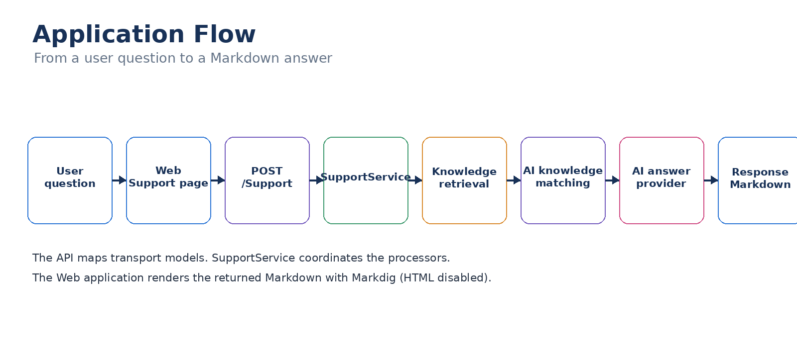

# Application flow

The request moves through the web application, API, support workflow, knowledge retrieval and matching, and answer generation.

## Request

1. The Blazor page validates that a question is present.
2. The web `SupportService` sends `POST /Support`.
3. `SupportController` maps `AskRequest` to `SupportRequest`.
4. `SupportService` asks `IKnowledgeProcessor` for relevant knowledge.
5. `KnowledgeProcessor` obtains the configured knowledge provider and loads knowledge.
6. `AiKnowledgeProcessor` uses the configured matcher provider to identify relevant documents.
7. `AiAnswerProcessor` uses the configured answer provider.
8. The API maps the result to `AskResponse`.
9. The web application renders the returned Markdown.

## Current provider path

Knowledge retrieval uses:

`KnowledgeProviderFactory` → `MarkdownKnowledgeProvider` → `MarkdownKnowledgeRepository`

Knowledge matching uses:

`AiKnowledgeMatcherFactory` → `OpenAiKnowledgeMatcherProvider` → OpenAI

Answer generation uses:

`AiAnswerProviderFactory` → `OpenAiAnswerProvider` → OpenAI

The answer provider receives the original question and the matched `KnowledgeContext`.
