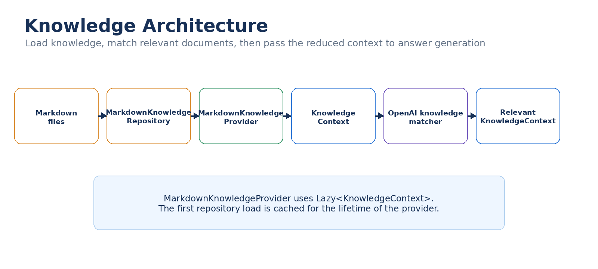

# Knowledge architecture

Knowledge retrieval and knowledge matching are separate stages.

## Retrieval

`KnowledgeProcessor` obtains the configured `IKnowledgeProvider`.

The current path is:

`KnowledgeProcessor` → `KnowledgeProviderFactory` → `MarkdownKnowledgeProvider` → `MarkdownKnowledgeRepository`

The repository reads Markdown files and creates `KnowledgeDocument` instances.

The provider wraps those documents in a `KnowledgeContext` and caches it.

## Matching

`KnowledgeProcessor` passes the available `KnowledgeContext` to `IAiKnowledgeProcessor`.

`AiKnowledgeProcessor` obtains its configured `IAiKnowledgeMatcherProvider` through `IAiKnowledgeMatcherFactory`.

The current matcher is `OpenAiKnowledgeMatcherProvider`.

It asks OpenAI to identify relevant document names, deserializes the JSON response, and constructs a new context containing only matching documents.

## Why separate the stages?

The source of knowledge and the mechanism used to decide relevance are different concerns.

A different knowledge source can therefore be introduced without changing the matcher, and a different matcher can be introduced without changing the Markdown repository.

The answer provider receives the reduced context rather than the complete knowledge set.
