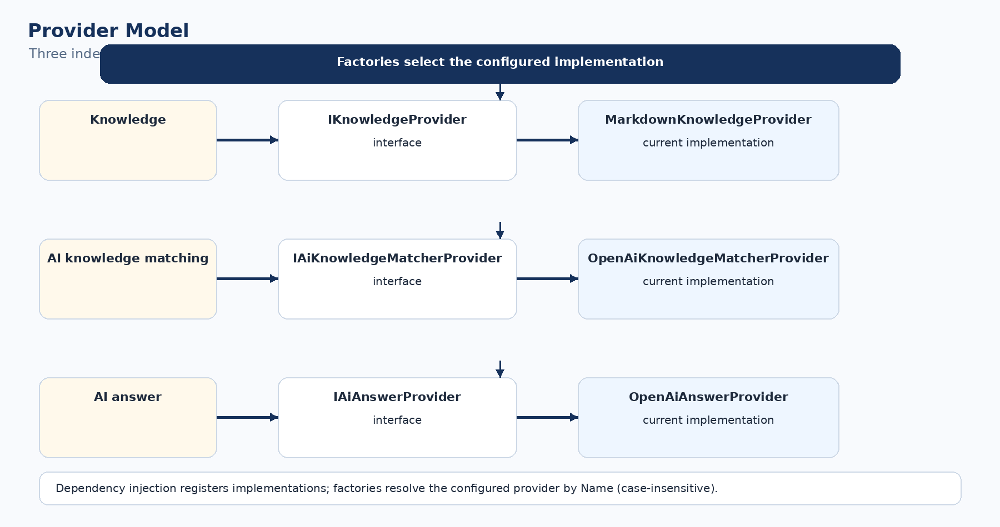

# Provider Model

The application uses interfaces, factories and dependency injection to keep infrastructure implementations separate from the support workflow.

## Three provider types

The source contains three independent provider abstractions:

| Capability | Interface | Current implementation |
|---|---|---|
| Knowledge | `IKnowledgeProvider` | `MarkdownKnowledgeProvider` |
| Knowledge matching | `IAiKnowledgeMatcherProvider` | `OpenAiKnowledgeMatcherProvider` |
| Answer generation | `IAiAnswerProvider` | `OpenAiAnswerProvider` |

Each provider exposes a `Name` and is selected by its corresponding factory.

## Factories

The factories receive all registered implementations and compare their `Name` with the configured provider name, ignoring case.

- `KnowledgeProviderFactory`
- `AiKnowledgeMatcherFactory`
- `AiAnswerProviderFactory`

If no implementation matches, the factory throws `InvalidOperationException`. Multiple matching implementations also cause the selection to fail.

## Dependency injection

`KnowledgeConfiguration` registers the knowledge repository, provider, factory and processor as singletons.

`AiConfiguration` registers the two keyed `ChatClient` instances plus the AI providers, factories and processors as singletons.

`ServiceConfiguration` registers `SupportService` as scoped.

## Adding a provider

A new implementation can follow the existing pattern:

1. Implement the appropriate provider interface.
2. Give it a unique `Name`.
3. Register it with dependency injection.
4. Configure that name in the relevant options section.

For knowledge providers, add repository infrastructure when the source requires it.

The processors and `SupportService` can continue to depend on their abstractions.

## Important detail

Knowledge matching and answer generation are separate provider concerns. Replacing the answer provider does not require replacing the knowledge matcher, and vice versa.

The same separation applies to knowledge retrieval: the provider abstraction is distinct from `IKnowledgeRepository`.
